<div align="center">
<picture>
  <source media="(prefers-color-scheme: dark)" srcset="assets/brand/orbforge-wordmark-dark.png">
  <source media="(prefers-color-scheme: light)" srcset="assets/brand/orbforge-wordmark-light.png">
  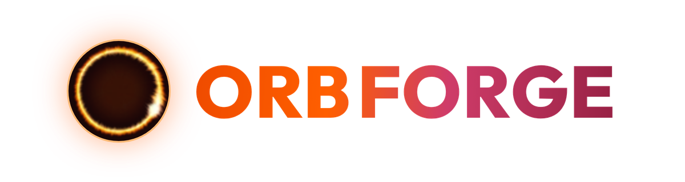
</picture>

#### burning rings · glassy globes · plasma cores · 3D wireframe sculptures · live WebGL console · 40 parameters · seeded archetypes · editable layers · 12 built-in presets · WebP · GIF · PNG · JPG · JSON export

# AI agent avatar synthesizer: shape an orb, download the loop

**[Features](#features) | [Presets](#preset-gallery) | [Grab an orb](#grab-an-orb) | [Getting started](#getting-started) | [Shortcuts](#json-io-and-shortcuts)**

### [🔥 Forge your orb → orbforge.wranngle.com](https://orbforge.wranngle.com)

Free, runs entirely in your browser, no login or account required.

**❤️ [Sponsor this project](https://github.com/sponsors/wranngle) ❤️**

[](https://github.com/wranngle/ORBFORGE/actions/workflows/ci.yml)
[](https://github.com/wranngle/ORBFORGE/releases/latest)
[](LICENSE)
[](https://github.com/wranngle/ORBFORGE/commits/main)
[](https://github.com/wranngle/ORBFORGE/graphs/contributors)

[](https://github.com/wranngle/ORBFORGE/stargazers)
[](https://github.com/wranngle)
</div>

---

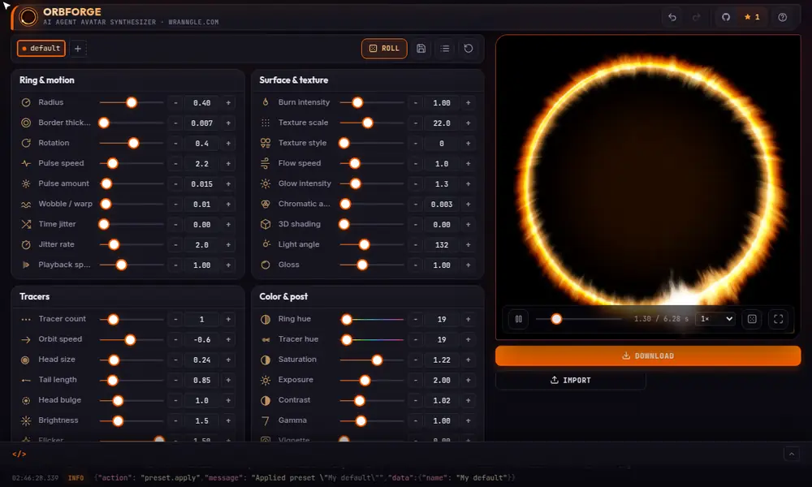

ORBFORGE is a WebGL console that renders a living animated orb — a burning ring, a glassy globe, a plasma core, a 3D wireframe sculpture — and exports it as a transparent animated WebP or GIF, a single PNG or JPG frame, or a JSON recipe, seed and full config baked into every file. Dial the 40 parameters by hand, roll a seeded archetype, stack editable layers, or start from one of 12 built-in presets; loop durations solve to whole cycle counts, so every animated export repeats without a visible seam. It is a static page with no build step, no server, and no account.

## 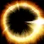 Features

- 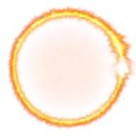 **Live WebGL preview**: seven surface texture styles (smoke, ridged filaments, plasma cells, banded rings, woven threads, stipple dots, wire lattice) that wrap a true 3D sphere via longitude/latitude — spinning dot, wire, and ring matrices — plus torus and sphere lighting, a volumetric core with radial plasma filaments, orbiting tracers, adjustable playback speed, glow, chromatic aberration, and a video-player transport (play, pause, scrub, speed, fullscreen) over the render.
-  **40 parameters in seven groups**, each with a slider, hold-to-repeat steppers, and a typeable value field. Hovering a parameter draws a pink marching-ants marquee around the exact region of the render it controls, tracked live by the shader.
-  **Seeded, archetype-weighted randomize**: each roll picks a coherent archetype (burning ring, plasma ball, glassy sphere, wire mesh, lit sculpture, thick aura) with correlated parameter ranges, so distinct species emerge instead of uniform noise. Every roll stamps a human-readable seed (`plasma-4f2a`) that deterministically rebuilds the same orb — and Roll rerolls whichever layer you're editing.
-  **Editable layers**: stack up to 3 presets additively above the base orb for composite looks; each layer is a tab you can select to edit its own parameters, hide, roll, or remove — and every visible layer rides along in the animation and the JSON.
-  **Transparent by default**: true alpha out of the box, or bake in a solid or gradient backdrop with hex-precise colors.
-  **Five export formats**: animated **WebP** (browser-native, transparent) and **GIF** (built-in median-cut, Floyd-Steinberg, LZW encoder) for loops; **PNG** and **JPG** for a single frame you pick with a scrubber and preview in-dialog; and **JSON** for the re-importable recipe. A target-file-size auto-tuner picks resolution, fps, and quality to fit a byte cap; the animated size estimate updates live.
-  **12 built-in presets** plus user presets saved to `localStorage`, with undoable delete.
-  **Event log**: every action emits an ECS-shaped JSONL record you can copy or download as `.jsonl`.

## 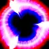 Preset gallery

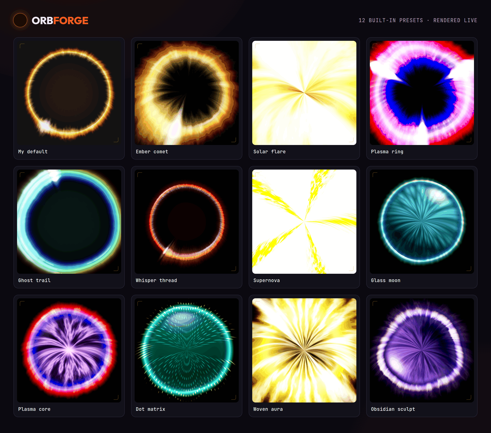

## 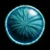 Grab an orb

The [**v1.1.0 capability pack**](https://github.com/wranngle/ORBFORGE/releases/tag/v1.1.0) ships six new orbs that show off the engine's newer tricks — true 3D longitude/latitude spheres, spinning dot and wire matrices, and volumetric cores. Drop one straight into a chat avatar, an agent UI, or a README; paste its seed into the in-app **Import** box to keep editing it.

| Orb | Preview | Seed | Frames |
| --- | :---: | --- | ---: |
| [Lattice bloom](https://github.com/wranngle/ORBFORGE/releases/download/v1.1.0/lattice-bloom.webp) |  | `plasma-9f2a` | 80 |
| [Sea urchin](https://github.com/wranngle/ORBFORGE/releases/download/v1.1.0/sea-urchin.webp) |  | `glass-4c71` | 79 |
| [Amethyst globe](https://github.com/wranngle/ORBFORGE/releases/download/v1.1.0/amethyst-globe.webp) |  | `sculpt-a13f` | 38 |
| [Crimson matrix](https://github.com/wranngle/ORBFORGE/releases/download/v1.1.0/crimson-matrix.webp) |  | `quasar-3e9b` | 73 |
| [Rose datasphere](https://github.com/wranngle/ORBFORGE/releases/download/v1.1.0/rose-datasphere.webp) |  | `flux-d8a1` | 94 |
| [Dusk halo](https://github.com/wranngle/ORBFORGE/releases/download/v1.1.0/dusk-halo.webp) |  | `nova-51cc` | 126 |

The original **[12 built-in presets](https://github.com/wranngle/ORBFORGE/releases/tag/v1.0.0)** ship pre-exported on v1.0.0.

## 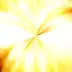 Getting started

1. Clone and serve

   ```bash
   git clone https://github.com/wranngle/ORBFORGE && cd ORBFORGE
   python3 -m http.server 8080
   ```

2. Open `http://localhost:8080`, pick a preset or hit ROLL, then click DOWNLOAD (animated WebP/GIF, a single PNG/JPG frame, or the JSON recipe).

Or skip the clone: the same page is live at [orbforge.wranngle.com](https://orbforge.wranngle.com).

WebGL is required for the preview; WebP export uses browser-native WebP encoding (Chrome, Edge, or a recent Firefox), and Safari falls back to the built-in GIF encoder.

## 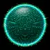 JSON I/O and shortcuts

| Control | Action |
| --- | --- |
| <kbd>⌘/Ctrl</kbd> + <kbd>Z</kbd> | Undo |
| <kbd>⌘/Ctrl</kbd> + <kbd>Shift</kbd> + <kbd>Z</kbd>, or <kbd>⌘/Ctrl</kbd> + <kbd>Y</kbd> | Redo |
| <kbd>Space</kbd> | Play or pause |
| <kbd>F</kbd> | Fullscreen |
| Download → JSON | Copy or download the full config; re-import it to keep editing |
| Import box | Paste a config JSON or a bare seed (`plasma-4f2a`) — or drop a `.json`, `.webp`, or `.gif` — to rebuild the exact orb |

## 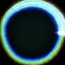 Where an orb goes

A finished orb is a small transparent looping image, so it goes anywhere one does.

<table>
<tr>
<td align="center" width="33%"><b>Agent avatars</b><br/>a face for your AI agent's idle and thinking states</td>
<td align="center" width="33%"><b>Chat UIs</b><br/>profile pictures that move in Slack, Discord, Teams</td>
<td align="center" width="33%"><b>Loading states</b><br/>a looping indicator in place of a spinner</td>
</tr>
<tr>
<td align="center" width="33%"><b>Stream overlays</b><br/>OBS and Twitch talking or brb badges</td>
<td align="center" width="33%"><b>README headers</b><br/>the glowing-glyph treatment this page uses</td>
<td align="center" width="33%"><b>...anywhere an image goes</b><br/>the export is a plain file</td>
</tr>
</table>

Named surfaces are usage examples, not integrations.

## 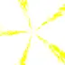 Star history

<!--
Restore this line when api.star-history.com recovers from its outage:
[](https://www.star-history.com/#wranngle/ORBFORGE&Date)
-->

[](https://www.star-history.com/#wranngle/ORBFORGE&Date)

[**View the interactive star history**](https://www.star-history.com/#wranngle/ORBFORGE&Date), drawn live even while star-history's image API is down.

## License

MIT © Wranngle Systems LLC. See [LICENSE](LICENSE).
