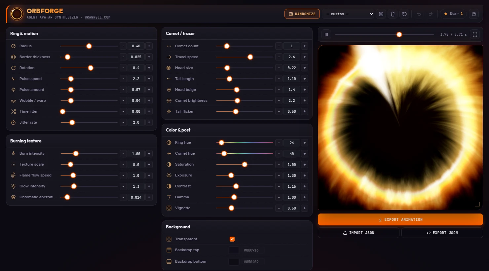

# Orb Forge

> agent-avatar synthesizer: burning comet-ring orb, 25 parameters in, animated WebP out

[](https://github.com/wranngle/orb_forge/actions/workflows/ci.yml) [](./LICENSE) 

> [!NOTE]
> Active personal project. Used in my own workflow. Issues triaged on a personal-time cadence.

**Live demo:** https://orb-forge.wranngle.com — free, runs entirely in your
browser, **no login or account required**.

## Quick start

```bash
git clone https://github.com/wranngle/orb_forge && cd orb_forge
python3 -m http.server 8080
# open http://localhost:8080
```

WebP export needs browser-native WebP encoding (Chrome, Edge, or a recent
Firefox). WebGL is required for the preview.

## What it does

- **Live WebGL preview**: a fragment-shader orb with seven surface texture
  styles (smoke, ridged filaments, plasma cells, banded rings, woven threads,
  stipple dots, wire lattice), 3D torus/sphere lighting with adjustable light
  angle and gloss, a volumetric core (solid lit body + radial plasma
  filaments), orbiting tracers, glow, chromatic aberration, time jitter
  (in-loop surge/reverse motion), and color post — with a video-player
  transport (play/pause, scrubbing, fullscreen) overlaid on the preview.
- **34 parameters** in six aligned groups, each with a slider, ±steppers
  (hold to repeat), and a typeable value field. Hovering or adjusting a
  parameter pink-highlights the exact region of the render it controls,
  tracked in real time by the shader.
- **Seeded, archetype-weighted randomize**: each roll first picks a coherent
  archetype (comet ring, plasma ball, glassy sphere, wire mesh, lit sculpture,
  thick aura) with correlated parameter ranges, so distinct species emerge
  instead of uniform noise. Every roll gets a human-readable seed
  (`plasma-4f2a`) that deterministically rebuilds the same orb — re-enter it
  via the seed dialog, share it, or find it stamped in the export JSON.
- **Preset overlays**: stack up to 3 presets additively above the base orb
  for composite looks; overlays export with the animation and the JSON.
- **Background**: transparent by default (true alpha), or bake in a solid /
  gradient backdrop with hex-precise colors.
- **Presets**: twelve built-ins (including engine showcases like Glass moon,
  Dot matrix, and Obsidian sculpt) plus user presets saved to `localStorage`,
  with undoable delete.
- **Animated WebP + GIF export**: WebP (recommended) via browser-native
  encoding muxed into a transparent animated file; GIF via a built-in
  median-cut + Floyd–Steinberg + LZW encoder for universal playback. Loop
  durations are solved for seamless repeats; a target-file-size auto-tuner
  fits WebP exports under a cap; the size estimate updates live; the finished
  file previews in-dialog.
- **JSON I/O**: copy, download, or paste a full parameter config.
- **Undo / redo**: `⌘/Ctrl+Z`, `⌘/Ctrl+Shift+Z` (or `Y`); `Space` toggles
  play; `F` toggles fullscreen.
- **Event log**: every action emits an ECS-shaped JSONL record you can copy
  or download as `.jsonl` (collapsed footer bar — click to expand).

## Structure

| File         | Purpose                                              |
|--------------|------------------------------------------------------|
| `index.html` | Markup + design-system styles (inline `<style>`).    |
| `app.js`     | The engine: controls, WebGL render loop, WebP muxer. |
| `_headers`   | Cloudflare Pages security headers (CSP, caching).    |
| `og.png`     | Social-unfurl card. Regenerate with `npm run og`.    |
| `tests/`     | Outcome-based e2e: renders in headless Chrome and validates the exported WebP bytes. |

It is a static site with no build step. The engine is a single external script
so the page ships a strict CSP (`script-src 'self'`, no inline script).

## Deploy

Cloudflare Pages (direct upload). Pushes to `main` that touch the site files
auto-deploy via `.github/workflows/deploy.yml`, which stages them into `dist/`
and runs `wrangler pages deploy`; `_headers` is applied automatically.

## License

MIT © Wranngle Systems LLC. See [LICENSE](LICENSE).
